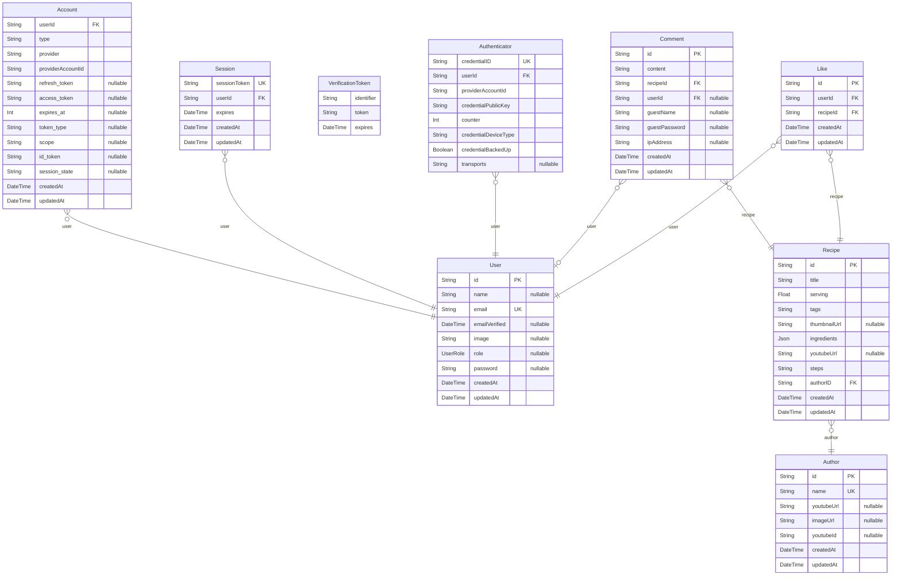

# Recipe
> Generated by [`prisma-markdown`](https://github.com/samchon/prisma-markdown)

- [default](#default)

## default

### `User`

**Properties**
  - `id`: 
  - `name`: 
  - `email`: 
  - `emailVerified`: 
  - `image`: 
  - `role`: 
  - `password`: 
  - `createdAt`: 
  - `updatedAt`: 

### `Account`

**Properties**
  - `userId`: 
  - `type`: 
  - `provider`: 
  - `providerAccountId`: 
  - `refresh_token`: 
  - `access_token`: 
  - `expires_at`: 
  - `token_type`: 
  - `scope`: 
  - `id_token`: 
  - `session_state`: 
  - `createdAt`: 
  - `updatedAt`: 

### `Session`

**Properties**
  - `sessionToken`: 
  - `userId`: 
  - `expires`: 
  - `createdAt`: 
  - `updatedAt`: 

### `VerificationToken`

**Properties**
  - `identifier`: 
  - `token`: 
  - `expires`: 

### `Authenticator`

**Properties**
  - `credentialID`: 
  - `userId`: 
  - `providerAccountId`: 
  - `credentialPublicKey`: 
  - `counter`: 
  - `credentialDeviceType`: 
  - `credentialBackedUp`: 
  - `transports`: 

### `Recipe`

**Properties**
  - `id`: 
  - `title`: 
  - `serving`: 
  - `tags`: 
  - `thumbnailUrl`: 
  - `ingredients`: 
  - `youtubeUrl`: 
  - `steps`: 
  - `authorID`: 
  - `createdAt`: 
  - `updatedAt`: 

### `Author`

**Properties**
  - `id`: 
  - `name`: 
  - `youtubeUrl`: 
  - `imageUrl`: 
  - `youtubeId`: 
  - `createdAt`: 
  - `updatedAt`: 

### `Comment`

**Properties**
  - `id`: 
  - `content`: 
  - `recipeId`: 
  - `userId`: 
  - `guestName`: 
  - `guestPassword`: 
  - `ipAddress`: 
  - `createdAt`: 
  - `updatedAt`: 

### `Like`

**Properties**
  - `id`: 
  - `userId`: 
  - `recipeId`: 
  - `createdAt`: 
  - `updatedAt`: 